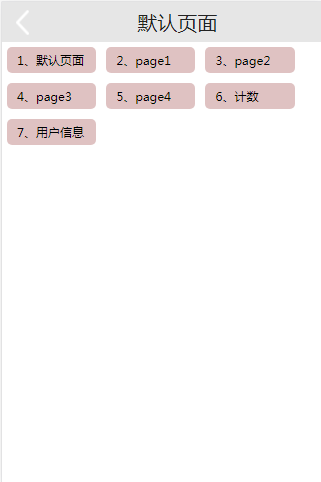

# react-webpack-demo  


## 关于
当前项目模版中使用到的技术：

* [React 16](https://github.com/facebook/react) 
* [React Router4](https://github.com/rackt/react-router)
* [React Hot Loader](https://github.com/gaearon/react-hot-loader) 模块热加载 
* [Babel](http://babeljs.io) ES6 、ES7 语法转换
* [Webpack3](http://webpack.github.io) 打包工具
* [webpack Dev Server](http://github.com/webpack/webpack-dev-serverl)
* [Redux](https://github.com/rackt/redux) 
* [React Router Redux](https://github.com/reactjs/react-router-redux) Redux/React 路由绑定.
* [ESLint](http://eslint.org) 保持一致的代码风格
* [Superagent](https://github.com/visionmedia/superagent) 接口调用
* [bundle-loader](https://github.com/webpack-contrib/bundle-loader) 按需要加载相应页面的JS
* [Postcss Loader](https://github.com/postcss/postcss-loader) 兼容不同浏览器样式加前缀


## 安装
```bash
npm install
或者
yarn install
```

## 运行开发环境
```base
npm run dev
```
起来在浏览器上输入：http://127.0.0.1:11111/react； /react这个是可以在config.js里进行配置，这个就是route basename。



## 项目打包
```base
npm run build
```
项目打包后，会在项目根目录里生成 dist/www目录，拿到这个就可以进行部署了。

如果部署到Nginx里面，如果出现在404的时候，可以参考：[Nginx配置ReactJs项目，Url后面直接输入路由路径时老报404问题。](http://blog.csdn.net/xiaotuni/article/details/77745189)

## image 引入
```
render(){
  const image = require('../img/demo.png);
  return(
    <div style={{background:'url(' + image + ')'}}></div>
  );
}
```
## 样式引入
```
render(){
  const styles = require('./scss/style.scss');
  return (
    <div className = {styles.className}> class name</div>
  );
}
```

----

## 引入scss

webpack.dev.config
```code
const styles = require('./demo.scss');

render(){
  return(
    <div className={styles.className}>content</div>
  );
}
```
### 配置 url:https://github.com/webpack-contrib/css-loader
```

{
  test: /\.scss$/,
  use: [
    { loader: "style-loader" },
    {
      loader: "css-loader", options: {
        sourceMap: true,
        modules: true, minimize: true,
        localIdentName: '[local]_[hash:base64:5]'
      }
    },
    {loader: "sass-loader", options:{sourceMap:true }}
  ]
}
```


## 参与文献
* [从零搭建React全家桶框架教程](https://github.com/brickspert/blog/issues/1)
* [React Redux Universal Hot Example](https://github.com/erikras/react-redux-universal-hot-example)
